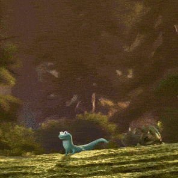

# talk-quarto-editable

Slides for a talk about editable Quarto documents. Built with Quarto revealjs and animated with [anime.js](https://animejs.com) v3.

## Layout

| Path | What it is |
| --- | --- |
| `index.qmd` | The slides. |
| `gallery.qmd` | A deck with one slide per fragment style. Render it to see everything, and to check nothing broke. |
| `fragments.html` | `SlideFx`: the fragment framework. Utilities plus a registry that gives every style caching, restore, and cancellation. |
| `fragment-styles.html` | The library of fragment styles built on `SlideFx`. |
| `all-the-js-code.html` | The float and collaborative-editing slides, plus the four original fragment styles that predate `SlideFx`. |
| `styles.scss` | Theme, animated-slide layout, cursor, and fragment chrome styles. |
| `_extensions/revealjs-anime/` | Small plugin that binds animations to RevealJS slide and fragment lifecycle events. Bring your own animation library. |
| `_collab-slide.qmd` | Markup for the collaborative-editing slide. |

Render with `quarto render index.qmd`, or `quarto preview index.qmd` while working.

## Drag-in fragments

A fragment marked `.drag-in` is hauled onto the slide by a little collaborator cursor when it is shown, and hauled back off the same edge when it is hidden (going backwards through the deck).

```markdown
::: {.fragment .drag-in from="left" cursor="Kari"}
Content that a cursor hauls in from the left.
:::
```

All attributes are optional:

| Attribute | Default | Meaning |
| --- | --- | --- |
| `from` | nearest side edge | Edge to enter from: `left`, `right`, `top`, or `bottom`. |
| `cursor` | no label | Name shown on the cursor's tag. Omit for a bare arrow. |
| `color` | next palette color | Cursor color, any CSS color. |
| `duration` | `900` | Length of the haul in milliseconds. |

Several in a row, each with its own collaborator:

```markdown
::: {.fragment .drag-in from="left" cursor="Kari"}
First point.
:::

::: {.fragment .drag-in from="right" cursor="John"}
Second point.
:::

::: {.fragment .drag-in from="bottom" cursor="Hailey" duration="1200"}
Third point, arriving slower.
:::
```

The marker also works on elements *inside* a fragment, which is handy when several things should ride in together on one keypress:

```markdown
::: fragment
{.drag-in from="top" width="200"}

[Two things, one keypress.]{.drag-in from="bottom" cursor="Kari"}
:::
```

Each inner element gets its own cursor and its own `from` edge, so they can converge from different directions on a single keypress.

### One cursor drops it wrong, another fixes it

Add `fix="Name"` and the haul becomes a two-cursor bit: the first cursor drops the content slightly off its mark and leaves, then a second cursor flies in from the other side of the slide, grabs it, and nudges it into place.

```markdown
::: {.fragment .drag-in from="left" cursor="Kari" fix="John"}
Kari drops this a bit short, and John nudges it into place.
:::
```

| Attribute | Default | Meaning |
| --- | --- | --- |
| `fix` | off | Name of the correcting cursor. Its presence is what enables the whole bit. |
| `fix-color` | next palette color | Color of the correcting cursor. |
| `fix-delay` | `450` | Beat between the sloppy drop and the correction arriving, in ms. |
| `off` | short of the mark, plus a little cross-axis drift | How wrong the first drop is, as `"x,y"` in slide px relative to the resting position. |

The default miss stops short along the axis the content travelled and drifts a little off it, which is what a real fumbled drag looks like. Override it with `off` for a specific gag, e.g. `off="0,-90"` to drop something too high.

The whole sequence runs about 3.2s at default timings. The correction is built into the same anime.js timeline as the haul rather than scheduled on a timer, so navigating away mid-bit cancels it cleanly, and if you interrupt while the content is still sitting off its mark it gets dragged out from where it actually is rather than snapping to rest first.

### Notes

- Write the attributes without a `data-` prefix, as above. Quarto rewrites unknown div attributes on the way out, so `from="left"` becomes `data-from="left"` in the rendered HTML; the code reads either spelling.
- Cursors are absolutely positioned inside the `<section>`, and a slide hosting `.drag-in` content gets `overflow: visible` so nothing is clipped while off-slide. Content parked off-slide is clipped by `.reveal` itself. Do not add `position: relative` to those sections: Reveal positions sections absolutely, and overriding it drops them into normal flow so every later slide renders in the wrong place. Reveal's own positioning already makes the section a containing block.
- Reveal's default fragment transition is `all`, which fights anime.js over the `transform`. `styles.scss` narrows it to `opacity` for `.drag-in` and lets anime own the movement.
- `transform` does not apply to non-replaced inline elements, so `span.drag-in` gets `display: inline-block` in `styles.scss`. Without it a `[text]{.drag-in}` span would sit there and refuse to move. Images are fine either way.
- On the way out, Reveal drops the `visible` class immediately, so the code adds `.drag-leaving` to hold the element on screen until the animation finishes.
- Positions are computed at the moment the fragment fires, from the element's resting layout position. Nothing needs hardcoded coordinates, and the effect survives window resizes between fragments.

## Type-in fragments

A fragment marked `.type-in` has its text typed out: a cursor flies in, types the content one character at a time while the caret blinks, and leaves.

```markdown
::: {.fragment .type-in cursor="Hailey"}
Hailey types this out, then leaves.
:::

::: {.fragment .type-in cursor="John" from="right" speed="35"}
John is a faster typist.
:::
```

| Attribute | Default | Meaning |
| --- | --- | --- |
| `cursor` | no label | Name shown on the cursor's tag. |
| `color` | next palette color | Cursor color. |
| `speed` | `55` | Milliseconds per character. Lower is faster. |
| `from` | `left` | Edge the cursor arrives from: `left`, `right`, `top`, or `bottom`. |

The cursor tracks the caret as the line grows, so it stays at the point of typing rather than sitting still.

### Notes

- Plain text only. The element's original markup is cached and restored when the typing finishes, so inline formatting survives, but it is not itself typed. Anything with emphasis or links inside will type as flat text and then snap to formatted at the end.
- The block's height is pinned with `min-height` while typing, so a multi-line paragraph does not push the rest of the slide around as it fills in. The lock is released at the end.
- Leading and trailing whitespace is trimmed before typing. A markdown div's `textContent` is padded with newlines, and typing those spends visible keystrokes on invisible characters.
- Going backwards restores the full text immediately and parks the cursor, so the fragment is intact if you return to it, and it retypes from scratch on the way forward again.

## Multi-cursor fragments

A fragment marked `.multi-cursor` has every one of its lines typed at once, each by its own named cursor, all driven from a single tween so the keystrokes land in lockstep. The thing no WYSIWYG tool can do.

```markdown
::: {.fragment .multi-cursor cursors="Kari,John,Hailey,Dave,Iris"}
- setosa
- versicolor
- virginica
- a fourth line
- and a fifth
:::
```

| Attribute | Default | Meaning |
| --- | --- | --- |
| `cursors` | no labels | Comma-separated names, cycled if there are fewer names than lines. |
| `speed` | `55` | Milliseconds per character. |
| `from` | `left` | Edge the cursors arrive from. |

The cursors arrive staggered by 70ms each, which reads better than five appearing at once, but the typing itself is strictly simultaneous. A line shorter than the longest retires early: its caret disappears and its cursor leaves rather than hovering at a finished line.

### Which elements get typed

In order of preference:

1. Any descendants marked `.mc-line`, if there are any. Use this when the automatic choice is wrong.
2. Otherwise the children of the innermost single wrapper. A markdown div holding one `<ul>` resolves to the `<li>` elements rather than to the list as a whole.
3. Otherwise the container itself.

The resolved set is cached on the container. It has to be: the choice depends on which elements have text, and typing empties them, so recomputing on the way out would resolve to the wrong elements and restore nothing.

## Find-and-replace fragments

A fragment marked `.find-replace` gets searched in front of the audience: a find bar drops in, a cursor types the term, every match on the slide highlights at once, the replacement is typed, and Replace All swaps them all simultaneously. The gesture is familiar from every editor; hitting every match at once is the part a WYSIWYG tool cannot do.

```markdown
::: {.fragment .find-replace find="lizard" replace="gecko" cursor="Kari" bar="bottom"}
The lizard sits on a rock. A second lizard joins the first lizard, and a
third lizard watches. Every lizard here is a lizard.
:::
```

| Attribute | Default | Meaning |
| --- | --- | --- |
| `find` | required | Term to search for. Matching is case-insensitive, and the original casing of each match is preserved until it is replaced. |
| `replace` | required | Replacement text. |
| `cursor` | no label | Name on the cursor's tag. |
| `color` | next palette color | Cursor color. |
| `speed` | `55` | Milliseconds per character in the bar's fields. |
| `bar` | `top` | Where the find bar sits: `top` or `bottom`. |

The sequence runs about 5.5 seconds: bar in, cursor to the find field, type the term, highlight all matches with a 22ms stagger, type the replacement, press the button, swap every match, fade the highlights, bar and cursor out.

### Notes

- **Use `bar="bottom"` when text reaches the top-right corner.** The bar floats over the content, exactly as a real find bar does, which means it can cover a match. `top` is the default because it is what editors do, but for a slide the bottom-right corner is usually the empty one.
- Matches are found by walking text nodes and wrapping each hit in its own span, so markup already inside the container survives the search.
- The swap is driven off a single counter rather than one timer per match, which keeps it cancellable and makes the sweep deterministic.
- The whole container's markup is cached and restored on the way out, so navigating back leaves the original text with no leftover highlight spans, and the bit can be replayed.
- The find bar sits at `z-index: 860`, below the cursors at `900`. Otherwise the cursor vanishes behind the bar at the exact moment it clicks Replace All.

## The rest of the fragment library

The seventeen styles below are built on `SlideFx` (`fragments.html`) and defined in `fragment-styles.html`. Every one of them gets the same guarantees from the registry: original markup and inline styles are cached before anything is touched and restored when the fragment is hidden, timelines are cancelled on hide and on re-show, and cursors and chrome are pooled per element and cleaned up. `gallery.qmd` has a slide for each.

### Acting on content already on screen

Most of these animate something that is *already* visible, so the fragment carrying the class is an empty trigger and `for="#selector"` points at the target:

```markdown
::: {#headline}
A line that is already on the slide.
:::

::: {.fragment .nudge for="#headline" by="26,0" cursor="Kari"}
:::
```

Without `for`, a style acts on the marked element itself, which is what you want for `.paste-in`, `.race-in`, `.duplicate`, `.diff-in`, and `.drag-from-folder`.

Every style takes `cursor` (name on the tag), `color`, and `from` (entry edge). All three are optional: a cursor with no name renders as a bare arrow, which is what you want when the point is that *someone* edited the slide rather than who. No style invents a collaborator name for you. For the multi-cursor styles (`.cursor-idle`, `.race-in`, `.argue`) leave `cursors` off entirely and every arrow is anonymous.

Style-specific attributes:

| Style | What it does | Attributes |
| --- | --- | --- |
| `.retype` | Selects one wrong word, deletes it, types the replacement. | `word`, `to`, `speed` |
| `.nudge` | Shifts something a few px, then fusses over it again. | `by="26,0"` |
| `.paste-in` | A cursor moves to where the content belongs, the shortcut badge appears at the cursor, and the content pops in. | `badge="⌘V"` |
| `.approve` | Someone else's cursor arrives and reacts. | `mark="✓"` |
| `.cursor-idle` | Named cursors linger and drift so the slide feels inhabited. Loops until hidden. | `cursors`, `count` |
| `.race-in` | Everything arrives at once from different edges, each with its own cursor. | `cursors`, `stagger`, `duration` |
| `.resize-in` | Arrives at the wrong size; a cursor drags the corner handle to fix it. | `from-width="180"` |
| `.crop-in` | A cursor drags a crop edge inward. | `inset="0 26 0 0"` (top right bottom left, %) |
| `.rotate-handle` | A cursor turns the element by its rotation handle, with an angle readout. | `angle="-8"` |
| `.marquee-select` | A marquee is dragged around several items, then they move as a group. | `by="80,0"` |
| `.reorder` | One item is dragged up the list and the others move aside. | `item="3"`, `to="1"` |
| `.duplicate` | Option-drag repeatedly until one plot has become a facet grid. | `times="3"`, `gap` |
| `.diff-in` | Old text struck through in red, new in green, then settles to just new. | `was="twelve observations"` |
| `.undo` | Something visibly wrong, then the shortcut, then it snaps back. | `by="110,30"`, `tilt`, `badge` |
| `.comment` | A cursor drops a sticky comment anchored to the target. | `text`, `cursor` (doubles as the author line; omit it and the bubble has no byline) |
| `.argue` | Two cursors drag the same thing in opposite directions. One wins. | `cursors="Kari,John"`, `amp`, `winner="right"` |
| `.drag-from-folder` | A folder window opens, a cursor drags a thumbnail out, and the drop becomes the real image. | `files`, `pick`, `folder`, `folder-x`, `folder-y`, `src` |

### Writing a new style

```js
SlideFx.define('my-style', {
  show(ctx) {
    const box = ctx.box();                 // target's box in slide coordinates
    const cursor = ctx.cursor();           // pooled, cleaned up for you
    const tl = ctx.tl();                   // tracked, cancelled for you
    const entry = SlideFx.flyIn(tl, cursor, ctx.from(), box, 0);
    // ... add tweens ...
    SlideFx.flyOut(tl, cursor, entry, 1200);
  },
});
```

`ctx` also gives you `attr`, `num`, `pair`, `list` for reading attributes off the marker, `chrome(key, cls, html)` for creating tracked UI, and `el` / `section` / `frag`. Omit `hide` to get the default teardown, which is right for almost everything.

### Notes

Things worth knowing before writing a style, all of which caused a real bug here:

- **anime.js resolves a tween's start value when the tween is created**, which for a timeline is at build time. Setting a start position in a `begin` callback is too late, and the element animates from wherever it was parked. Use explicit `[from, to]` arrays, which is what `flyIn` does.
- **Never set `position: relative` on a hosting section.** Reveal positions sections absolutely; overriding it drops them into normal flow and every later slide renders in the wrong place.
- **`getBoundingClientRect()` includes the element's current transform.** Measure at rest, then reapply the offset.
- **A grab squeeze must not overlap a translate on the same element.** Two concurrent tweens on one transform leave a stale scale behind. `SlideFx.squeeze` returns the time it ends so the next tween can start after it.
- **`SlideFx.lines(el)` descends through single wrappers**, so a markdown div holding one `<ul>` resolves to the `<li>` elements. Do not cache the result: hiding a fragment restores `innerHTML`, which replaces those nodes.
- **`easeOutBack` ignores its overshoot argument** in anime v3 (it is fixed at about 13%). Use keyframes when the overshoot has to be tunable, and cap it in px, since travel distance includes the element's own width.

## Hand-written animated slides

For anything more involved than a drag-in, a slide gets a marker class and its animation is registered against the lifecycle:

```js
RevealAnime.defineSlide('collab-slide', {
  enter: (section) => { /* ... */ return stopFn; },
  leave: (section) => { /* ... */ },
  fragments: {
    'frag-id': (section) => { /* ... */ return stopFn; },
    'other-id': { show: (section) => {}, hide: (section) => {} },
  },
});
```

A runner returns a `stopFn`, called automatically on slide leave, on fragment hide, and if the same fragment is shown again. `RevealAnime.slideCoordsOf(section, el)` converts an element's screen rectangle into slide-internal coordinates, which is what anime.js `translateX`/`translateY` values on slide children are measured in. The slide is 1280x720 (`RevealAnime.SLIDE_W` / `SLIDE_H`).

The float slide (`.float-slide`) and the collaborative-editing slide (`.collab-slide`) are the two worked examples in `all-the-js-code.html`.
